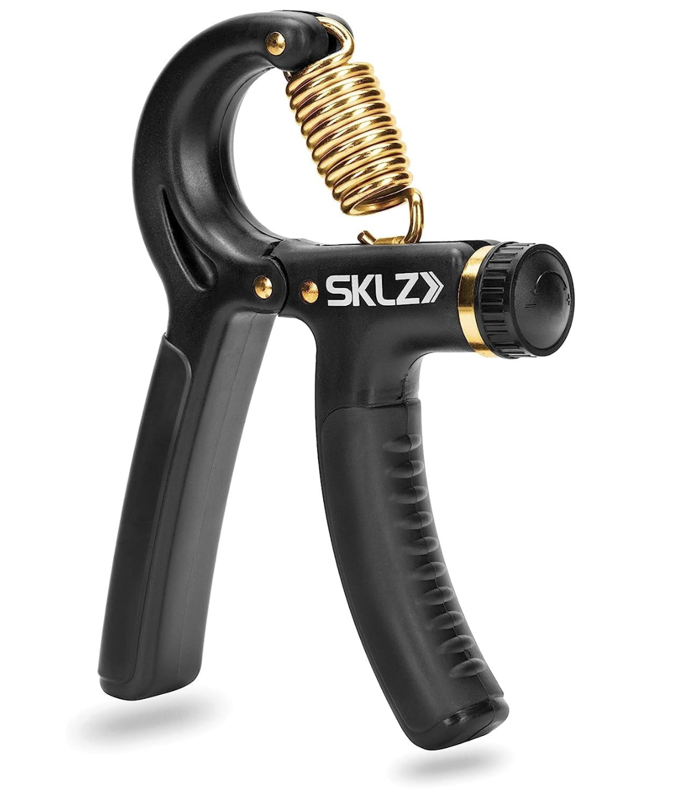
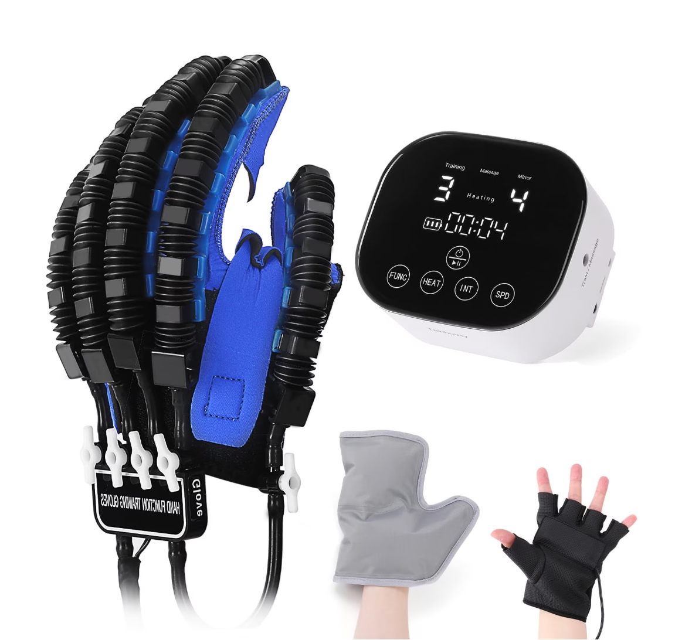
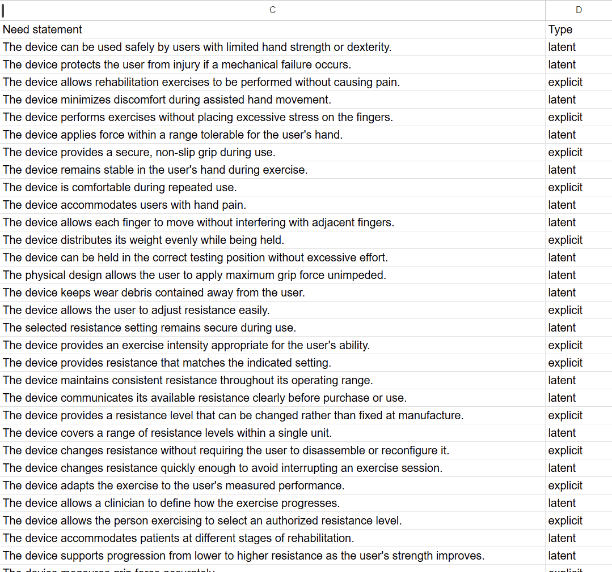

# User Needs and Benchmarking

## 1. Mission Statement and Charter Review

**Question 1: What is your group trying to accomplish?**

Our group is developing a prescription-based automatic resistance grip trainer for hand rehabilitation. The device measures the force a user actually applies through a load cell and a custom analog front end, and automatically adjusts its own mechanical resistance to a level prescribed by a clinician, so that a progression plan can be carried out without manual reconfiguration and without losing the record of what the patient actually did.

**Question 2: What is the community you are trying to serve, or who are your target users?**

Our primary users are physical therapists and occupational therapists who manage hand rehabilitation for patients recovering from stroke, hand surgery, or tendon injury, and for patients living with arthritis. Our secondary users are those patients themselves, performing prescribed exercises at home between clinic visits.

Reviewing these answers against our existing mission statement and charter, we found that both documents described the device we intended to build but did not identify a specific user community. We have therefore updated the charter to name clinicians as the primary users and home-exercising patients as secondary users, because this distinction drives which needs we prioritize throughout this assignment.

---

## 2. Voice of the Customer Benchmarking

We benchmarked six commercial products and two patents. Products were selected to cover three categories: direct competitors (adjustable-resistance grip trainers), measurement-only devices (digital dynamometers), and partial-solution devices that address only one aspect of hand rehabilitation but contain features worth borrowing.

### Search #1

**Keywords:** "Strength Trainer"

**Search Results Link:** [https://www.amazon.com/s?k=Strength+Trainer](https://www.amazon.com/s?k=Strength+Trainer&crid=216I4TMBPYM7L&sprefix=strength+trainer%2Caps%2C192&ref=nb_sb_noss_1)

#### Product 1 — Grip Strength Trainer

- **Product link:** [SKLZ Grip Strength Trainer](https://www.amazon.com/dp/B07GQ2JBDR)

- **Price:** $18.22 (price checked 2026-09-14)

- **Vendor:** Amazon

- **Description:** An adjustable hand gripper offering 20 lb to 90 lb of resistance, marketed for finger, hand, wrist and forearm strengthening, and for rehabilitation, circulation and stress relief.

**Figure 1. Adjustable grip strength trainer used as Product 1.**

##### Positive Comments

| Voice of the Customer | Restated Customer Need |
| --- | --- |
| "Great for hand and wrist therapy." | 1. The device supports rehabilitation of the hand and wrist. **(explicit)** 2. The device can be used safely by users with limited hand strength or dexterity. **(latent)** |
| "Great build quality. Easy to adjust resistance." | 3. The device allows the user to adjust the resistance easily. **(explicit)** 4. The resistance setting remains secure during use. **(latent)** |
| "Great to take anywhere." | 5. The device is portable and easy to transport. **(explicit)** 6. The device can be used in different locations without permanent installation. **(latent)** |
| "This is an easy way to relive your tension. Just grip and breathe in and exhale" | 7. The device helps the user relieve stress and tension. **(explicit)** 8. The device can be used without requiring the user's visual attention. **(latent)** 9. The device supports short, self-directed exercise sessions. **(latent)** |
| "Easy to adjust and use" | 10. The device is operated through a small number of simple actions. **(explicit)** 11. The device requires little or no training before use. **(latent)** |

##### Negative Comments

| Voice of the Customer | Restated Customer Need |
| --- | --- |
| "This hand exerciser snapped in half after 5 weeks." | 12. The device withstands repeated use without structural failure. **(explicit)** 13. The device protects the user from injury if a mechanical failure occurs. **(latent)** |
| "Very cheaply made" | 14. The construction quality of the device is evident to the user on first handling. **(explicit)** 15. The device feels solid and dependable during normal use. **(latent)** |
| "The product worked well when it did, but it wasn't able to be put to its full value in my opinion." | 16. The device remains usable across the full range of exercises it is sold for. **(explicit)** 17. The usable lifetime of the device matches what the user expects at purchase. **(latent)** |
| "I was totally digging this hand gripper...I liked the rubberized handles and the variable levels of resistance. I was using this gripper mainly to warm up my hands before using my heavier captains of crush grippers, and all was fine and dandy until I noticed what looked like grinded pieces of the plastic on my lap. Appears that the handles are rubbing against each other at the hinge, causing a shredding of the plastic. Garbage product." | 18. The device maintains its material integrity at points of repeated contact. **(explicit)** 19. The device retains a smooth and consistent motion throughout repeated use. **(latent)** 20. The device keeps wear debris contained away from the user. **(latent)** |
| "No grip" | 21. The device provides a secure, non-slip grip during use. **(explicit)** 22. The device remains stable in the user's hand during exercise. **(latent)** |

---

### Search #2

**Keywords:** "Grip Strength Trainer with Counter"

**Search Results Link:** [https://www.walmart.com/search?q=grip+strength+trainer+with+counter](https://www.walmart.com/search?q=grip+strength+trainer+with+counter)

#### Product 2 — BN-LINK Grip Strength Trainer with Counter

- **Product link:** [BN-LINK Grip Strength Trainer with Counter](https://www.walmart.com/ip/5152536453)

- **Price:** $10.99 (price checked 2026-09-14)

- **Vendor:** Walmart

- **Description:** A two-pack grip trainer with adjustable resistance from 11 lb to 132 lb and a mechanical counter that tracks up to 99 repetitions. Marketed for grip strengthening, wrist and forearm exercise, injury rehabilitation, and stress relief.

**Figure 2. BN-LINK grip strength trainer with integrated repetition counter.**

##### Positive Comments

| Voice of the Customer | Restated Customer Need |
| --- | --- |
| "It's comfortable in my hand." | 1. The device is comfortable during repeated use. **(explicit)** 2. The device accommodates users with hand pain. **(latent)** |
| "Well made, adjustable, with a counter." | 3. The device allows the user to adjust exercise intensity. **(explicit)** 4. The device records completed repetitions automatically. **(explicit)** 5. The device withstands repeated exercise sessions. **(latent)** |
| "Has some grip to it so it doesnt slip out of your hand. Great for all ages." | 6. The device maintains secure contact with the user's hand during squeezing. **(explicit)** 7. The device accommodates users across different age groups. **(explicit)** 8. The device can be controlled without requiring excessive hand stabilization. **(latent)** |

##### Negative Comments

| Voice of the Customer | Restated Customer Need |
| --- | --- |
| "They're both right-handed grips." | 9. The device is usable with either hand. **(explicit)** 10. The resistance setting and exercise information remain visible during either left- or right-handed use. **(latent)** |
| "The tension does not feel as strong." | 11. The device provides resistance that matches the indicated setting. **(explicit)** 12. The device maintains consistent resistance throughout its operating range. **(latent)** |
| "I have a fairly large hands and I don't think this particular model would work well for someone whose hands are fairly small." | 13. The device accommodates users with different hand sizes. **(explicit)** 14. The grip span of the device can be matched to the user's hand before exercising. **(latent)** |

---

### Search #3

**Keywords:** "Finger Hand Exerciser Rehabilitation"

**Search Results Link:** [https://www.walmart.com/search?q=finger+hand+exerciser+rehabilitation](https://www.walmart.com/search?q=finger+hand+exerciser+rehabilitation)

#### Product 3 — CanDo Digi-Flex Hand and Finger Exerciser

- **Product link:** [CanDo Digi-Flex Hand and Finger Exerciser](https://www.walmart.com/ip/15171760)

- **Price:** $17.89 for the blue resistance level (price checked 2026-09-14)

- **Vendor:** Walmart

- **Description:** A compact rehabilitation device that allows the user to exercise each finger independently or compress the device with the whole hand. Colour-coded models provide progressively higher resistance levels.

**Figure 3. CanDo Digi-Flex hand and finger exerciser.**

##### Positive Comments

| Voice of the Customer | Restated Customer Need |
| --- | --- |
| "Sturdy and works for strengthening my hand very well." | 1. The device effectively strengthens the user's hand. **(explicit)** 2. The device remains structurally reliable during repeated rehabilitation exercises. **(latent)** |
| "It strengthens each finger." | 3. The device exercises individual fingers independently. **(explicit)** 4. The device prevents stronger fingers from compensating for weaker fingers. **(latent)** |
| "It comes with instructions that show different ways to use it." | 5. The device provides clear guidance for performing different exercises. **(explicit)** 6. The device helps the user select exercises that match different rehabilitation goals. **(latent)** |

##### Negative Comments

| Voice of the Customer | Restated Customer Need |
| --- | --- |
| "There is basically no resistance." | 7. The device provides an exercise intensity appropriate for the user's ability. **(explicit)** 8. The device communicates its available resistance clearly before purchase or use. **(latent)** |
| "The keys are not quite wide enough." | 9. The device accommodates different finger sizes and spacing. **(explicit)** 10. The device allows each finger to move without interfering with adjacent fingers. **(latent)** |
| "Too bad it isn't sold as a pair." | 11. The device supports simultaneous exercise of both hands. **(explicit)** 12. The device allows the user to train both hands under equivalent conditions. **(latent)** |

---

### Search #4

**Keywords:** "Digital Grip Strength Trainer"

**Search Results Link:** [https://www.google.com/search?q=digital+grip+strength+trainer](https://www.google.com/search?q=digital+grip+strength+trainer)

#### Product 4 — Squegg Digital Hand Grip Strengthener

- **Product link:** [Squegg Digital Hand Grip Strengthener](https://www.mysquegg.com/products/squegg-digital-grip-strengthener)

- **Price:** $129.00 (price checked 2026-09-14)

- **Vendor:** Squegg

- **Description:** A portable digital grip and pinch trainer that measures applied force, records repetitions, tracks progress over time, and provides interactive exercises. It connects to a mobile application and is marketed for home rehabilitation with remote progress monitoring.

**Figure 4. Squegg digital grip strengthener and companion mobile application.**

##### Positive Comments

| Voice of the Customer | Restated Customer Need |
| --- | --- |
| "Quick and easy setup." | 1. The device can be prepared for use quickly. **(explicit)** 2. The device can be set up by the user without assistance from a clinician. **(latent)** |
| "The games are fun." | 3. The device makes repetitive exercises engaging. **(explicit)** 4. The device motivates users to complete their prescribed exercises. **(latent)** |
| "If you have any concerns or problems, just contact them and they are very responsive." | 5. The user receives timely assistance when a problem occurs. **(explicit)** 6. The device can be returned to normal operation with minimal interruption to the user's rehabilitation schedule. **(latent)** |

##### Negative Comments

| Voice of the Customer | Restated Customer Need |
| --- | --- |
| "The grip reading was about 20–25 lb. less." | 7. The device measures grip force accurately. **(explicit)** 8. The device produces measurements consistent with clinical assessment equipment. **(latent)** 9. The device maintains stable calibration over time. **(latent)** |
| "The device only worked for a month." | 10. The device continues to function well beyond the first weeks of ownership. **(explicit)** 11. The device preserves its measurement and training functions after repeated use. **(latent)** 12. The device allows users to recover their training records after a failure or replacement. **(latent)** |
| "The graphics and scoring totally changed and not for the better." | 13. The device maintains a consistent and familiar training experience following updates. **(explicit)** 14. The device preserves established exercise settings and progress following updates. **(latent)** 15. The device clearly communicates changes to exercises and performance feedback before they take effect. **(latent)** |

---

### Search #5

**Keywords:** "digital hand dynamometer"

**Search Results Link:** [https://www.amazon.com/s?k=digital+hand+dynamometer](https://www.amazon.com/s?k=digital+hand+dynamometer&crid=1HJLH28QVJ2YP&sprefix=Digital+Hand+Dynamometer%2Caps%2C246&ref=nb_sb_ss_p13n-expert-pd-ops-ranker_1_24)

#### Product 5 — CAMRY Digital Hand Dynamometer

- **Product link:** [CAMRY Digital Hand Dynamometer](https://www.amazon.com/dp/B0DCZ7VN1S)

- **Price:** $32.99 (price checked 2026-09-14)

- **Vendor:** Amazon

- **Description:** A digital dynamometer that measures grip strength up to 198 lb (90 kg) and displays the maximum measured force automatically. It has an adjustable grip bar and a digital screen for measuring and tracking hand-grip strength.

**Figure 5. CAMRY digital hand dynamometer.**

##### Positive Comments

| Voice of the Customer | Restated Customer Need |
| --- | --- |
| "Works well. Great to track strengthening progress." | 1. The device records grip-strength measurements at multiple points over time. **(explicit)** 2. The device shows the amount and direction of change between measurement sessions. **(latent)** 3. The device associates each measurement with the correct testing session. **(latent)** |
| "I was amazed how important hand strength is. And I can do a daily check." | 4. The device supports repeated daily grip-strength checks. **(explicit)** 5. The device produces results in a consistent format for day-to-day comparison. **(latent)** |
| "Easy to use. Does everything the manufacturer describes. Happy." | 6. The device completes a measurement with a minimal number of user actions. **(explicit)** 7. The device performs its advertised measurement functions reliably. **(explicit)** 8. The controls of the device are understandable without consulting documentation. **(latent)** |

##### Negative Comments

| Voice of the Customer | Restated Customer Need |
| --- | --- |
| "This hand force testing device works, but the storage of measurements only contains the last measurement, sometimes it turns itself off. It's not useful if you want to do a circle of continuous measurements on your own, as it won't remember anything except the last measured force. If you only care about a one time measurement you probably are good but it's useless for other test protocols. I've also found it quite uncomfortable to hold as it's quite top heavy and the hand holding bars are not comfortable either." | 9. The device stores multiple consecutive grip-force measurements without overwriting previous results. **(explicit)** 10. The device remains powered on throughout an active sequence of measurements. **(explicit)** 11. The device supports continuous testing protocols without requiring results to be recorded manually after each measurement. **(latent)** 12. The device distributes its weight evenly while being held. **(explicit)** 13. The hand-contact surfaces remain comfortable during repeated measurements. **(explicit)** 14. The device can be held in the correct testing position without excessive effort. **(latent)** 15. The physical design allows the user to apply maximum grip force unimpeded. **(latent)** |
| "It always shows normal results" | 16. The device displays a grip-strength classification that corresponds to the measured result. **(explicit)** 17. The device distinguishes between below-normal, normal, and above-normal grip-strength results. **(latent)** |
| "Very hard to use" | 18. The device can be operated by users with limited grip strength. **(explicit)** 19. The device accommodates patients at different stages of rehabilitation. **(latent)** 20. The device allows a therapist to obtain measurements without unnecessary difficulty for the patient. **(latent)** |

---

### Search #6

**Keywords:** "Rehabilitation Robot Gloves Stroke Hand Recovery"

**Search Results Link:** [https://www.walmart.com/search?q=rehabilitation+robot+gloves+stroke+hand+recovery](https://www.walmart.com/search?q=rehabilitation+robot+gloves+stroke+hand+recovery)

#### Product 6 — Tairibousy Rehabilitation Robot Glove

- **Product link:** [Tairibousy Rehabilitation Robot Glove](https://www.walmart.com/ip/Rehabilitation-Robot-Gloves-Stroke-Hemiplegia-Intelligent-Massage-Hand-Function-Robot-Gloves-Rehabilitation-Training-Glove/6966516310)

- **Price:** $85.99 (price checked 2026-09-14)

- **Vendor:** Walmart

- **Description:** A powered hand rehabilitation glove that assists hand and finger movement during rehabilitation. It supports hand flexion, extension, grip-strength training, and assisted rehabilitation exercises. This product does not solve the same problem as our device, but it is included because it is an actuated rehabilitation device operating directly on a patient's hand, which is the closest available analogue to our resistance-adjustment mechanism.

**Figure 6. Tairibousy powered rehabilitation glove.**

##### Positive Comments

| Voice of the Customer | Restated Customer Need |
| --- | --- |
| "No pain at all while using it" | 1. The device allows rehabilitation exercises to be performed without causing pain. **(explicit)** 2. The device minimizes discomfort during assisted hand movement. **(latent)** |
| "When he is relaxed enough to get his hands in there it works amazing and theres not too much stress on his fingers" | 3. The device performs assisted exercises without placing excessive stress on the fingers. **(explicit)** 4. The device supports rehabilitation of sensitive or weakened fingers. **(latent)** 5. The device applies force within a range tolerable for the user's hand. **(latent)** |
| "I purchased this item for my mother in law to help a relative who had a stroke to aid in getting flexibility back in her hand that had seized up. It's doing wonders for her." | 6. The device helps restore hand flexibility during rehabilitation. **(explicit)** 7. The device assists movement of hands with severely restricted mobility. **(latent)** 8. The device supports recovery of range of motion following loss of mobility. **(latent)** |

##### Negative Comments

| Voice of the Customer | Restated Customer Need |
| --- | --- |
| "Sizes are not as shown... if you wear a large, get extra large." | 9. The device provides sizing that corresponds to the stated size. **(explicit)** 10. The device provides enough fit information for the user to select an appropriate size. **(latent)** |
| "Does not work. Had to return the wrong size and the one that fit only works on the training function" | 11. The device provides all advertised rehabilitation functions reliably. **(explicit)** 12. The device maintains functionality across its different operating modes. **(latent)** 13. The device fits correctly without requiring product replacement. **(latent)** |
| "Product did not work" | 14. The device operates reliably when received by the user. **(explicit)** 15. The device is ready to perform its intended functions on first use. **(latent)** |

---

## 3. Patent Benchmarking

Patents were benchmarked in addition to the commercial products above. Because patents have no customer reviews, the source statements below are drawn from the background and summary sections of each patent, where the inventors describe the shortcomings of prior devices. These statements are paraphrased unless shown in quotation marks.

### Patent Search #1

**Keywords:** "variable resistance hand rehabilitation device"

**Search Results Link:** [https://patents.google.com/?q=(variable+resistance+hand+rehabilitation+device)](https://patents.google.com/?q=(variable+resistance+hand+rehabilitation+device))

#### Patent 1 — Variable Resistance Exercise and Rehabilitation Hand Device

- **Patent number:** WO2006099484A1

- **Inventors / Applicant:** Northeastern University (Boston) and Northeastern University (China)

- **Priority date:** 14 March 2005 · **Published:** 21 September 2006

- **Patent link:** [WO2006099484A1](https://patents.google.com/patent/WO2006099484A1/en)

- **Description:** A portable hand exercise and rehabilitation device whose resistance is produced by smart-fluid brakes and dampers. The resistance can be altered in real time under computerized control, so that the exercise or rehabilitation session is tuned to how the user responds. The corresponding US family member (US20090017993A1) describes four subsystems: a smart-fluid resistive element, a gearbox, handles, and two sensors — an optical encoder and a force sensor — that measure the motion and force produced by the patient.

| Statement from the patent | Restated Customer Need |
| --- | --- |
| Existing hand training and rehabilitation devices are usually built on simple mechanical systems such as springs, which provide a fixed resistive force. | 1. The device provides a resistance level that can be changed rather than fixed at manufacture. **(explicit)** 2. The device covers a range of resistance levels within a single unit. **(latent)** |
| The resistance of the device can be changed "on-the-fly, through computerize control." | 3. The device changes its resistance without the user disassembling or reconfiguring it. **(explicit)** 4. The device changes resistance quickly enough not to interrupt an exercise session. **(latent)** |
| The device tunes the workout or rehabilitation session to the responses of the user. | 5. The device adapts the exercise to the user's measured performance. **(explicit)** 6. The device allows a clinician to define how the exercise progresses. **(latent)** |
| The device includes sensors that measure the motion and the force produced by the patient. | 7. The device measures the force the patient actually applies during exercise. **(explicit)** |

**Relevance to our project:** This patent is the closest prior art to our concept, because it also combines force measurement with automatically controlled resistance for hand rehabilitation. It differs in mechanism: the patented device varies resistance by changing the rheology of a smart fluid under computer control, whereas our design varies spring preload mechanically using a DC motor driving a lead screw, and measures force with a load cell and a custom analog front end. The patent confirms that automatic resistance adjustment is a recognized need in this field and establishes the vocabulary we use to describe it.

### Patent Search #2

**Keywords:** "portable hand wrist rehabilitation controllable resistance"

**Search Results Link:** [https://patents.google.com/?q=(portable+hand+wrist+rehabilitation+controllable+resistance)](https://patents.google.com/?q=(portable+hand+wrist+rehabilitation+controllable+resistance))

#### Patent 2 — Portable Hand and Wrist Rehabilitation Device

- **Patent number:** US6117093A

- **Inventor:** J. D. Carlson · **Assignee:** Lord Corporation

- **Priority date:** 13 October 1998 · **Published:** 12 September 2000

- **Patent link:** [US6117093A](https://patents.google.com/patent/US6117093A/en)

- **Description:** A hand-held rehabilitation device containing a magnetorheological fluid brake. Interchangeable tool elements snap onto the brake shaft so that the patient can exercise different finger, hand and wrist movements, and the resistance level is selected by the patient using a knob on the housing.

| Statement from the patent | Restated Customer Need |
| --- | --- |
| Prior joint-exercise devices are large, expensive, stationary machines, so they are typically available only at clinics or therapists' offices. | 1. The device can be used outside a clinical facility. **(explicit)** 2. The device is affordable enough for an individual patient to own. **(latent)** |
| A patient must schedule and travel to appointments to use those machines, which limits how often and how long rehabilitation can be performed. | 3. The device allows the patient to exercise as often as the treatment plan requires. **(explicit)** 4. The device removes scheduling and travel as barriers to completing exercises. **(latent)** |
| There is a need for a rehabilitation device that can be carried to and used at a patient's home or other convenient place. | 5. The device can be carried by hand to the place where it will be used. **(explicit)** 6. The device is ready to use with minimal setup after being moved. **(latent)** |
| The device includes a controller that allows the patient to set the level of resistance. | 7. The device allows the person exercising to select the resistance level themselves. **(explicit)** |

**Relevance to our project:** This patent establishes the home-use and portability requirements that our device inherits, and it articulates the cost and access problem that motivates putting clinic-grade adjustable resistance into a personally owned device. Its resistance mechanism, a magnetorheological brake with knob selection, differs from ours in two ways that matter: resistance is set manually by the user rather than prescribed and applied automatically, and the device measures nothing.

---

## 4. User Needs Development Process

### 4.1 Method

Each of the three team members first reviewed the commercial products and patents assigned to them and independently translated the source statements into positive user-need statements. Both explicit needs stated directly by users and latent needs inferred from the context of their comments were included. The individual statements were then pooled into a shared workspace without changing their original wording so that the team could review the complete set together.

Category labels were proposed asynchronously by all three members based on recurring themes, consolidated into a single scheme, and circulated for review before the ratings began. The team agreed on seven categories: safety and comfort; resistance and progression; measurement and data; usability, fit, and accessibility; therapeutic capability; reliability and support; and portability and access. A higher-level meta-need was written for each category to express the common purpose of the needs in that group.

Duplicate needs were identified by comparing meaning rather than exact wording. When two statements described the same outcome, the team retained the clearer and more general version or combined the statements into one implementation-independent need. For example, statements about portability, use outside a clinic, and freedom from permanent installation were separated only when they represented different user outcomes. Statements concerning structural durability and reliable operation were also distinguished so that physical failure and loss of functionality remained separate needs.

The team ranked the needs using a five-point importance scale, where 5 represented a critical rehabilitation or safety requirement and 1 represented a desirable but lower-priority feature. Each member rated the complete set of 100 needs independently, and the three ratings for each need were averaged to give its position in the ranking. Individual raters differed in severity, with member means of 3.80, 4.19 and 4.14; because all three rated every need, this offset shifts the whole set and does not distort the relative order. Needs where the member ratings differed by two or more points were flagged and reviewed against the target users, the mission statement, and the severity of the problem shown by the benchmark evidence.

The highest-rated individual needs concentrate on safety under mechanical failure, secure and uninterrupted resistance adjustment, and the accuracy of the force measurement itself. Data-management needs such as automatic repetition logging and record recovery rated substantially lower, which is why the Measurement and Data category mean falls below the other categories even though it contains several of the highest-rated individual needs.

### 4.2 Initial placement of all need statements

The three members' individual benchmarking produced 112 raw need statements before any consolidation. Table 1 records the composition of that pooled set. Consolidating duplicates as described above reduced the 112 raw statements to the 100 unique needs listed in section 5.

**Table 1. Composition of the pooled need statements before categorisation.**

| Benchmark source | Raw need statements |
| --- | --- |
| Product 1 — SKLZ Grip Strength Trainer | 22 |
| Product 2 — BN-LINK Grip Strength Trainer with Counter | 14 |
| Product 3 — CanDo Digi-Flex Hand and Finger Exerciser | 12 |
| Product 4 — Squegg Digital Hand Grip Strengthener | 15 |
| Product 5 — CAMRY Digital Hand Dynamometer | 20 |
| Product 6 — Tairibousy Rehabilitation Robot Glove | 15 |
| Patent 1 — WO2006099484A1 | 7 |
| Patent 2 — US6117093A | 7 |
| **Total raw statements** | **112** |
| **Unique needs after consolidation** | **100** |

**Figure 7. The complete set of 100 need statements as first pooled from the three members' individual benchmarking, before categorisation.**

### 4.3 Needs grouped into categories

**Figure 8. Need statements grouped into categories, with the meta-need for each group shown in bold.**

### 4.4 Needs ranked

Each member rated all 100 needs independently on the five-point scale, and the needs were then ordered by their mean rating. Figure 9 shows the result. Of the 100 needs, 18 reached the maximum mean of 5.00 and 9 fell at or below 2.50.

**Figure 9. Need statements after ranking, ordered by mean importance rating across the three members.**

Table 2 gives the resulting priority order of the seven categories.

**Table 2. Categories in order of mean importance rating.**

| Priority | Category | Mean rating | Needs |
| --- | --- | --- | --- |
| 1 | Resistance and Progression | 4.33 | 15 |
| 2 | Usability, Fit, and Accessibility | 4.14 | 17 |
| 3 | Reliability and Support | 4.09 | 15 |
| 4 | Safety and Comfort | 4.07 | 15 |
| 5 | Therapeutic Capability | 4.00 | 16 |
| 6 | Portability and Access | 3.83 | 4 |
| 7 | Measurement and Data | 3.74 | 18 |

Nineteen needs showed a rating spread of two or more points between members, and three of those differed by three points: storing consecutive force measurements without overwriting previous results, setting the device up without clinician assistance, and portability. In each case the disagreement traced to whether the need was judged from the perspective of a clinic workflow or of a patient exercising at home. These were resolved by applying the priority established in our charter, which names clinicians as the primary users and home-exercising patients as secondary users. The resolution for each flagged need is recorded in the notes column of the rating sheet.

<!-- TODO: confirm the paragraph above matches what the team actually wrote in the
     Notes column of the spreadsheet. If a different reason was recorded for any
     of the three, edit this paragraph to match the sheet. -->

The complete rating sheet is available as a
[downloadable spreadsheet](https://egr304-2026-f-103.github.io/User%20Need%20Benchmark.xlsx).
It contains each member's individual ratings for all 100 needs, the computed
means, the rating spread across members, and the team's notes on the needs where
member ratings differed by two or more points.

---

## 5. Compiled List of User Needs

The needs are grouped by the seven categories agreed by the team. The categories themselves are prioritised in Table 2, and the ranked order of the individual needs is shown in Figure 9 and in the linked rating sheet. Within a category, needs that received the same mean rating are of equal priority. The numbers below are identifiers used for cross-referencing between this page and the rating sheet; they are not the rank order.

### Category 1 — Safety and Comfort

**Meta-need: The device protects the user and remains physically comfortable throughout rehabilitation.**

1. The device can be used safely by users with limited hand strength or dexterity. **(latent)**

2. The device protects the user from injury if a mechanical failure occurs. **(latent)**

3. The device allows rehabilitation exercises to be performed without causing pain. **(explicit)**

4. The device minimizes discomfort during assisted hand movement. **(latent)**

5. The device performs exercises without placing excessive stress on the fingers. **(explicit)**

6. The device applies force within a range tolerable for the user's hand. **(latent)**

7. The device provides a secure, non-slip grip during use. **(explicit)**

8. The device remains stable in the user's hand during exercise. **(latent)**

9. The device is comfortable during repeated use. **(explicit)**

10. The device accommodates users with hand pain. **(latent)**

11. The device allows each finger to move without interfering with adjacent fingers. **(latent)**

12. The device distributes its weight evenly while being held. **(explicit)**

13. The device can be held in the correct testing position without excessive effort. **(latent)**

14. The physical design allows the user to apply maximum grip force unimpeded. **(latent)**

15. The device keeps wear debris contained away from the user. **(latent)**

### Category 2 — Resistance and Progression

**Meta-need: The device provides accurate, controllable resistance that supports a clinician-directed progression plan.**

16. The device allows the user to adjust resistance easily. **(explicit)**

17. The selected resistance setting remains secure during use. **(latent)**

18. The device provides an exercise intensity appropriate for the user's ability. **(explicit)**

19. The device provides resistance that matches the indicated setting. **(explicit)**

20. The device maintains consistent resistance throughout its operating range. **(latent)**

21. The device communicates its available resistance clearly before purchase or use. **(latent)**

22. The device provides a resistance level that can be changed rather than fixed at manufacture. **(explicit)**

23. The device covers a range of resistance levels within a single unit. **(latent)**

24. The device changes resistance without requiring the user to disassemble or reconfigure it. **(explicit)**

25. The device changes resistance quickly enough to avoid interrupting an exercise session. **(latent)**

26. The device adapts the exercise to the user's measured performance. **(explicit)**

27. The device allows a clinician to define how the exercise progresses. **(latent)**

28. The device allows the person exercising to select an authorized resistance level. **(explicit)**

29. The device accommodates patients at different stages of rehabilitation. **(latent)**

30. The device supports progression from lower to higher resistance as the user's strength improves. **(latent)**

### Category 3 — Measurement and Data

**Meta-need: The device produces accurate measurements and preserves complete, interpretable rehabilitation records.**

31. The device measures grip force accurately. **(explicit)**

32. The device produces measurements consistent with clinical assessment equipment. **(latent)**

33. The device maintains stable calibration over time. **(latent)**

34. The device measures the force the patient actually applies during exercise. **(explicit)**

35. The device records completed repetitions automatically. **(explicit)**

36. The device records grip-strength measurements at multiple points over time. **(explicit)**

37. The device shows the amount and direction of change between measurement sessions. **(latent)**

38. The device associates each measurement with the correct testing session. **(latent)**

39. The device supports repeated daily grip-strength checks. **(explicit)**

40. The device produces results in a consistent format for day-to-day comparison. **(latent)**

41. The device completes a measurement with a minimal number of user actions. **(explicit)**

42. The device performs its advertised measurement functions reliably. **(explicit)**

43. The device stores multiple consecutive grip-force measurements without overwriting previous results. **(explicit)**

44. The device remains powered on throughout an active sequence of measurements. **(explicit)**

45. The device supports continuous testing protocols without requiring manual recording after each measurement. **(latent)**

46. The device displays a grip-strength classification that corresponds to the measured result. **(explicit)**

47. The device distinguishes between below-normal, normal, and above-normal grip-strength results. **(latent)**

48. The device allows users to recover their training records after a failure or replacement. **(latent)**

### Category 4 — Usability, Fit, and Accessibility

**Meta-need: The device fits a broad range of users and can be operated correctly with minimal assistance.**

49. The device is operated through a small number of simple actions. **(explicit)**

50. The device requires little or no training before use. **(latent)**

51. The device provides clear guidance for performing different exercises. **(explicit)**

52. The device helps the user select exercises that match different rehabilitation goals. **(latent)**

53. The device is usable with either hand. **(explicit)**

54. Resistance settings and exercise information remain visible during left- or right-handed use. **(latent)**

55. The device accommodates users with different hand sizes. **(explicit)**

56. The grip span of the device can be matched to the user's hand before exercising. **(latent)**

57. The device accommodates different finger sizes and spacing. **(explicit)**

58. The device accommodates users across different age groups. **(explicit)**

59. The device can be operated by users with limited grip strength. **(explicit)**

60. The stated device size corresponds to its actual fit. **(explicit)**

61. The device provides enough fit information for the user to select an appropriate size. **(latent)**

62. The device fits correctly without requiring product replacement. **(latent)**

63. The device can be prepared for use quickly. **(explicit)**

64. The device can be set up by the user without assistance from a clinician. **(latent)**

65. The device is ready to perform its intended functions on first use. **(latent)**

### Category 5 — Therapeutic Capability

**Meta-need: The device supports effective exercises for different hand functions and rehabilitation conditions.**

66. The device supports rehabilitation of the hand and wrist. **(explicit)**

67. The device effectively strengthens the user's hand. **(explicit)**

68. The device exercises individual fingers independently. **(explicit)**

69. The device prevents stronger fingers from compensating for weaker fingers. **(latent)**

70. The device supports simultaneous exercise of both hands. **(explicit)**

71. The device allows the user to train both hands under equivalent conditions. **(latent)**

72. The device supports rehabilitation of sensitive or weakened fingers. **(latent)**

73. The device helps restore hand flexibility during rehabilitation. **(explicit)**

74. The device assists movement of hands with severely restricted mobility. **(latent)**

75. The device supports recovery of range of motion following loss of mobility. **(latent)**

76. The device remains usable across the full range of exercises for which it is sold. **(explicit)**

77. The device provides all advertised rehabilitation functions. **(explicit)**

78. The device supports different rehabilitation operating modes. **(latent)**

79. The device helps the user relieve stress and tension. **(explicit)**

80. The device can be used without requiring the user's visual attention. **(latent)**

81. The device supports short, self-directed exercise sessions. **(latent)**

### Category 6 — Reliability and Support

**Meta-need: The device remains dependable throughout its service life and can be restored quickly when problems occur.**

82. The device withstands repeated use without structural failure. **(explicit)**

83. The construction quality of the device is evident to the user on first handling. **(explicit)**

84. The device feels solid and dependable during normal use. **(latent)**

85. The usable lifetime of the device matches what the user expects at purchase. **(latent)**

86. The device maintains its material integrity at points of repeated contact. **(explicit)**

87. The device retains smooth and consistent motion throughout repeated use. **(latent)**

88. The device continues to function well beyond the first weeks of ownership. **(explicit)**

89. The device preserves its measurement and training functions after repeated use. **(latent)**

90. The device operates reliably when received by the user. **(explicit)**

91. The device maintains functionality across its different operating modes. **(latent)**

92. The device maintains a consistent and familiar training experience following updates. **(explicit)**

93. The device preserves established exercise settings and progress following updates. **(latent)**

94. The device clearly communicates changes to exercises and performance feedback before they take effect. **(latent)**

95. The user receives timely assistance when a problem occurs. **(explicit)**

96. The device can be returned to normal operation with minimal interruption to the user's rehabilitation schedule. **(latent)**

### Category 7 — Portability and Access

**Meta-need: The device makes prescribed rehabilitation accessible beyond the clinic.**

97. The device is portable and easy to transport. **(explicit)**

98. The device can be used outside a clinical facility without permanent installation. **(explicit)**

99. The device is affordable enough for an individual patient to own. **(latent)**

100. The device allows the patient to exercise as often as the treatment plan requires without scheduling or travel barriers. **(latent)**

---

## 6. References

[1] SKLZ Grip Strength Trainer. Amazon. [Online]. Available: https://www.amazon.com/dp/B07GQ2JBDR. [Accessed: Sep. 14, 2026].

[2] BN-LINK Grip Strength Trainer with Counter. Walmart. [Online]. Available: https://www.walmart.com/ip/5152536453. [Accessed: Sep. 14, 2026].

[3] CanDo Digi-Flex Hand and Finger Exerciser. Walmart. [Online]. Available: https://www.walmart.com/ip/15171760. [Accessed: Sep. 14, 2026].

[4] Squegg Digital Hand Grip Strengthener. Squegg. [Online]. Available: https://www.mysquegg.com/products/squegg-digital-grip-strengthener. [Accessed: Sep. 14, 2026].

[5] CAMRY Digital Hand Dynamometer. Amazon. [Online]. Available: https://www.amazon.com/dp/B0DCZ7VN1S. [Accessed: Sep. 14, 2026].

[6] Tairibousy Rehabilitation Robot Glove. Walmart. [Online]. Available: https://www.walmart.com/ip/6966516310. [Accessed: Sep. 14, 2026].

[7] A. Khanicheh et al., "Variable resistance exercise and rehabilitation hand device," WIPO Patent WO2006099484A1, Sep. 21, 2006.

[8] J. D. Carlson, "Portable hand and wrist rehabilitation device," U.S. Patent 6,117,093, Sep. 12, 2000.

---

## AI Use Disclosure

Generative AI tools, including Claude and ChatGPT, were used by Zice Sun
to interpret the assignment requirements, organize the report structure,
and draft or refine the Team Charter and Product Mission Statement. The
generated language was reviewed and approved by the team.

**Full query text:**

> 1. I'm working on the EGR 304 User Needs and Benchmarking now. Create
> the skeleton file according to rubric.
>
> 2. Give me some good directions for product choice.
>
> 3. Research and give me 3 related products, should cover different fields.
>
> 4. Check the assignment against rubric and give me all errors.
>
> 5. Design a fully functional online poll system for ranking part.
