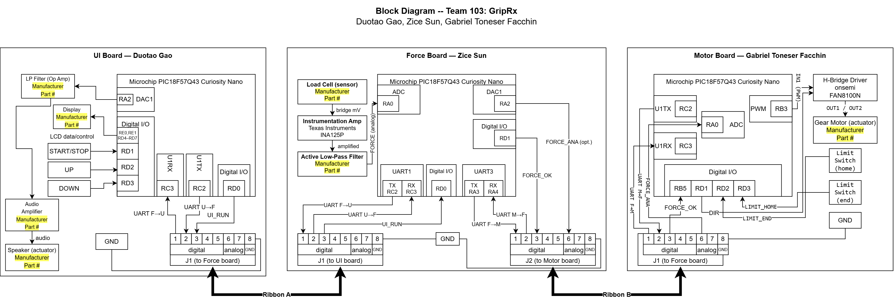

# Block Diagram, Process Diagram, and Message Structure

<!-- ============================================================
     HOW TO WORK ON THIS PAGE
     (HTML comments do not appear on the published page or in the PDF.
     No need to delete them when you are done.)

     DUE: Team: Block Diagram — Canvas, Fri 10/2 (confirm the time on
     Canvas). Submit BOTH: (1) the working URL of this page and (2) a PDF
     exported from the LIVE page.
     Points: 50 initial (completeness) + 150 External Design Review
     (quality, 10/26–10/30) + 50 final report = 250.

     WHAT THE ASSIGNMENT GRADES (Design Checklist on the course site)
       - Page is easy to find (linked from the landing page)      -> index.md
       - Each teammate's role is clear, sensors/actuators marked  -> §2, §4
       - Each subsystem: sufficient complexity, unique, has at
         least one sensor OR actuator                             -> §2, §6.2
       - Each microcontroller well-marked; every IC has
         Manufacturer + Part # (unknown = yellow highlight)       -> §4 figure
       - Wires use directional arrows + labels; lines tidy        -> §4 figure
       - >= 1 ribbon connector per teammate; class standard used
         (pins 1–5 digital, 6–7 analog, 8 GND)                    -> §5
       - Every used ribbon pin is mapped to a SPECIFIC MCU pin,
         never straight to a sensor/actuator                      -> §5
       - Individual block diagrams (due 10/5) match this one       -> §7
       - Spelling correct; image legible on the website           -> all

     OWNERSHIP
       Zice    — §1, §3, §5 Zice-side columns, §6, §7, AI disclosure;
                 master draw.io file (layout, connectors, cable arrows,
                 force board), PNG export, landing-page link, build,
                 PDF export, Canvas submission
       Gabriel — Motor board: his group in the draw.io file, his row in
                 Table 1, the Gabriel column of Table 3, spelling pass
                 on the finished diagram
       Duotao  — UI board: his group in the draw.io file, his row in
                 Table 1, the Duotao column of Table 2, Design Checklist
                 review of the live page before PDF export
       Everyone — the Step 1 meeting (topology + pin map decisions);
                 review §6 answers before export

     HARD RULES
       1. Ribbon pins connect to the teammate's MICROCONTROLLER pins only.
          A sensor or actuator never sits directly on a ribbon pin.
       2. Pin 8 = GND on every connector. Do NOT pass +5 V or 9 V through
          the ribbon — every board has its own barrel jack + 5 V regulator.
       3. Do not use RF0/RF1 (USB CDC serial = UART1, keep for debugging),
          RF3 (on-board LED0) or RB4 (on-board SW0) for team signals.
       4. UART TX/RX pins are chosen with PPS. Pick them in MCC Pin Grid
          View (it only offers legal pins) and copy the result here.
       5. The diagram is embedded as a PNG in this repo, and the .drawio
          source is committed next to it. Never link to a live Google
          Drive / draw.io file as the content of this page.
       6. Keep tables narrow (<= 6 short columns) for the PDF export.
     ============================================================ -->

## 1. Overview

<!-- OWNER: Zice. 3–5 sentences. What this page is, what the three
     boards are, and how to read the rest of the page. Report tone. -->

This page defines how the three subsystem boards of Team 103's prescription-based grip trainer connect and communicate. Each team member designs one board around a Microchip PIC18F57Q43 Curiosity Nano, and the boards are joined by 8-wire ribbon cables that follow the class connector standard. The force board sits in the middle of a daisy chain: it measures the grip force, runs the training session, and exchanges messages with the UI board on connector J1 and with the motor board on connector J2. Figure 1 shows the complete system, and Tables 2 and 3 map every ribbon-cable pin to a specific microcontroller pin on both ends of each link.

## 2. Subsystem Roles

<!-- OWNER: each person fills their own row; Zice checks consistency.
     Every IC needs Manufacturer + Part #. If a part is not chosen yet,
     write "TBD" here AND leave it highlighted yellow in the diagram.
     Sensor/actuator column must name the item that satisfies the course
     requirement (Course Sequence Requirements page):
       Zice    — load cell + amplifier + active filter = acceptable
                 analog sensor ("Load-cells & wheatstone bridges").
       Gabriel — DC gear motor on an H-bridge driver IC = acceptable
                 actuator (bidirectional, driver IC).
       Duotao  — speaker driven by DAC/PWM through a filter + amplifier
                 stage = acceptable actuator. Display and buttons are
                 extra user interface, they do NOT count on their own. -->

**Table 1. Subsystem boards and their owners.**

| Board | Owner | Main function | Sensor / actuator | Key ICs (Manufacturer, Part #) |
|---|---|---|---|---|
| Force board (center) | Zice Sun | Measures grip force, runs the session logic, relays messages between the other two boards | Sensor: load cell (bridge output amplified by an instrumentation amplifier and an active low-pass filter); load cell manufacturer/part # TBD | Microchip PIC18F57Q43; Texas Instruments INA125P; low-pass filter op-amp manufacturer/part # TBD |
| Motor board | Gabriel Toneser Facchin | Receives resistance setpoints. Drives the DC gear motor (lead-screw spring preload) through an H-bridge driver, with home and end limit switches for position feedback. Reports its state. | Actuator: DC gear motor driven bidirectionally through an H-bridge driver IC. | Microchip PIC18F57Q43; onsemi FAN8100N; gear motor manufacturer/part # TBD |
| UI board | Duotao Gao | Read the start/stop, up and down buttons, control the display screen, generate sound feedback, and communicate with the force sensing board | Actuator: Speaker, driven by DAC1 output after passing through a low-pass filter and an audio amplifier. | Microchip PIC18F57Q43; The manufacturers and models of the low-pass filter operational amplifier and audio amplifier are yet to be determined. |

## 3. Connection Arrangement

<!-- OWNER: Zice. Explain the topology chosen at the Step 1 meeting and
     WHY. Points worth making (pick, do not list them all):
       - Daisy chain UI board <-> Force board <-> Motor board.
       - Force is the one quantity both other boards need, so the board
         that measures it sits in the middle; the two end boards never
         need to talk directly.
       - Every board-to-board link carries the same pattern of signals
         (UART on 1–2, a dedicated safety line on 3), so the center
         board's firmware for the two links is nearly identical.
       - Each link uses only 3–4 of the 7 signal pins, leaving spares
         for changes before the External Design Review. -->

The boards are connected in a daisy chain, with the force board in the middle: the UI board connects to connector J1 of the force board, and the motor board connects to connector J2. Grip force is the one quantity that both other boards need: the UI board displays it and the motor board limits resistance with it. Placing the board that measures force in the middle therefore lets each end board talk only to its neighbour, and the UI and motor boards never need a direct connection. Both links also use the same pattern of signals (UART on pins 1–2 and a dedicated safety line on pin 3), so the force board's firmware for J1 and J2 is nearly identical, and each link leaves several pins spare for changes before the External Design Review.

## 4. Team Block Diagram

<!-- OWNER: Zice merges; each member draws the inside of their own board.
     FILES (exact names, no spaces):
       docs/image/team-block-diagram.png     <- PNG export, transparent
       docs/image/team-block-diagram.drawio  <- draw.io source
     The PNG currently in the repo is a PLACEHOLDER. Overwrite it with
     your export using the same file name and this section updates
     itself. The .drawio link below shows a build warning until that
     file is committed — that is expected.
     draw.io export: File > Export as > PNG..., tick "Transparent
     Background", Zoom 200%, Border Width 10. Check the image is still
     readable on the live page AND in the exported PDF. -->

**Figure 1. Team 103 block diagram.** Arrows show signal direction, plain lines are ground, and yellow highlights mark parts whose manufacturer and part number have not been selected yet.

The editable source of Figure 1 is available as a [draw.io file](image/team-block-diagram.drawio).

## 5. Ribbon Cable Pin Assignments

<!-- OWNER: Zice fills the Signal / Direction / Zice-pin columns;
     Duotao fills his pin column in Table 2, Gabriel in Table 3.
     The Type column is the class standard — do not change it.
     Direction is written as source -> destination.
     MCU pin = the exact Curiosity Nano pin (e.g. "RA2 (DAC1)"), as set
     in MCC. Unused pins: Signal "Not connected", Direction "—", pin "—".
     The pin plan agreed at the Step 1 meeting goes here; the proposed
     plan is in the task guide PDF (section 3). -->

**Table 2. Connector J1: force board (Zice) to UI board (Duotao).**

| Pin | Type | Signal | Direction | Zice MCU pin | Duotao MCU pin |
|---|---|---|---|---|---|
| 1 | Digital | UART F→U | Force → UI | RC2 (U1TX) | RC3 (U1RX) |
| 2 | Digital | UART U→F | UI → Force | RC3 (U1RX) | RC2 (U1TX) |
| 3 | Digital | UI_RUN | UI → Force | RD0 (input) | RD0 (output) |
| 4 | Digital | Spare (not connected) | — | — | — |
| 5 | Digital | Spare (not connected) | — | — | — |
| 6 | Analog | Spare (not connected) | — | — | — |
| 7 | Analog | Spare (not connected) | — | — | — |
| 8 | Ground | Common ground | — | GND | GND |

**Table 3. Connector J2: force board (Zice) to motor board (Gabriel).**

| Pin | Type | Signal | Direction | Zice MCU pin | Gabriel MCU pin |
|---|---|---|---|---|---|
| 1 | Digital | UART F→M | Force → Motor | RA3 (U3TX) | RC3 (U1RX) |
| 2 | Digital | UART M→F | Motor → Force | RA4 (U3RX) | RC2 (U1TX) |
| 3 | Digital | FORCE_OK | Force → Motor | RD1 (output) | RB5 (input) |
| 4 | Digital | Spare (not connected) | — | — | — |
| 5 | Digital | Spare (not connected) | — | — | — |
| 6 | Analog | FORCE_ANA | Force → Motor | RA2 (DAC1) | RA0 (ADC, ANA0) |
| 7 | Analog | Spare (not connected) | — | — | — |
| 8 | Ground | Common ground | — | GND | GND |

UART pins follow the default UART1 (RC2/RC3) and UART3 (RA3/RA4) locations shown on the Curiosity Nano pinout, which keeps the debugger pins RB6/RB7 and the USB serial pins RF0/RF1 free. Both safety lines, UI_RUN and FORCE_OK, are active-high with a 10 kΩ pull-down at the receiving board, so an unplugged or broken cable reads as "stop" or "release resistance". No power is passed between boards; pin 8 only shares ground.

## 6. Design Decisions

<!-- OWNER: Zice writes from the Step 1 meeting notes; Gabriel and
     Duotao review. One short paragraph per question. These are the three
     questions the assignment tells the team to answer before drawing.
     Write what the TEAM decided and why, not a generic answer. -->

### 6.1 Minimizing interconnections

<!-- Question: "You only have 8-pin connectors. How do you divide
     functionality across the team in a way that minimizes
     interconnections between teammates?" -->

Each board owns a complete function — sensing, user interface or actuation — so only results cross the ribbon cables, never raw sensor or actuator signals. All data on a link travels over a single UART pair, so adding a new message later changes firmware rather than wiring. The only extra wire on each link is a dedicated safety line (UI_RUN or FORCE_OK) that stops the session or releases resistance without waiting for a UART message, plus one optional analog copy of the force signal for the motor board. As a result each link uses three or four of its seven signal pins, and the two end boards are never wired to each other.

### 6.2 Meeting the minimum requirements

<!-- Question: "Does your system layout ensure each teammate meets
     minimum project requirements?" Name each person's qualifying
     sensor/actuator and why it qualifies; say the three are different
     chips, functions and design processes, and that the team as a
     whole mixes sensing and actuation. -->

Every board has its own 5 V regulator, PIC18F57Q43 Curiosity Nano and at least one qualifying sensor or actuator. The force board's load cell produces a millivolt-level bridge signal that needs an INA125P instrumentation amplifier and an active low-pass filter before the ADC, which matches the course's list of acceptable analog sensors. The motor board drives a DC gear motor in both directions through an FAN8100N H-bridge driver IC, an acceptable actuator. The UI board drives a speaker from its DAC through a low-pass filter and an audio amplifier, also listed as an acceptable actuator. The three subsystems use different chips and design processes and do different jobs, and together the team combines sensing with two forms of actuation.

### 6.3 Risk if a teammate is lost

<!-- Question: "What are the risks to your system if you lose a
     teammate? How can you de-risk your system design by grouping and/or
     distributing similar functions between teammates?"
     Cover all three cases, including the honest one: the center board
     is the single point of failure. Say what the team does about it. -->

If the motor board were lost, the system could still measure force, count repetitions and display progress, and the UI board's speaker would keep actuation in the team. If the UI board were lost, the force board could send its data to a computer over the Curiosity Nano's USB serial port, and therapist settings could be entered from the computer. The force board is the single point of failure, because it holds both the sensor and the session logic. To reduce that risk, every link is fully specified on this page, so any Curiosity Nano wired to the same pins can stand in as the center board during testing. Each end board can also be tested on its own with a UART loopback jumper between pins 1 and 2, or with a computer serial terminal.

## 7. Next Steps

<!-- OWNER: Zice. 2–4 bullet points. -->

- Each member's individual block diagram (due 10/5) will use exactly the connector pins and microcontroller pins listed in Tables 2 and 3.
- Each member will confirm their pins in MCC's Pin Grid View and report any conflict to the team before the schematic stage.
- Parts still highlighted in yellow (load cell, filter op-amps, display, audio amplifier, speaker and gear motor) will be selected during component selection, and the diagram will be updated before the External Design Review.
- The process diagram and message structure for the UART links will be added to this page with the software proposal.

<!-- RESERVED — later assignments add to this page (the page title
     already names them). Leave hidden until then:
## Process Diagram
## Message Structure
-->

---

## AI Use Disclosure

Generative AI (Claude) was used by Zice Sun to read and summarize the assignment requirements, propose a division of work and a draft connector pin plan, generate this page's structure, write draw.io guides for each member, troubleshooting wiring errors found during the merge. The board roles and connection arrangement were chosen by the team, each member drew their own board, and the team reviewed and edited the diagram, pin assignments and text before submission.

Full query text:

1. I need to do the EGR 304 team assignment: assign tasks to the three team members, and produce the detailed steps and an overview as PDFs. If needed, create a skeleton file like before. [team repository link; assignment link]

2. For the draw.io part, generate a detailed step-by-step PDF for each person, including which keys to press, how to place parts and a rough explanation of the principles.

3. What are the individual images for?

4. Give me a few product names.

5. I tidied up the wiring a little; the changes are already in the merged file. Check if there are any issues.
